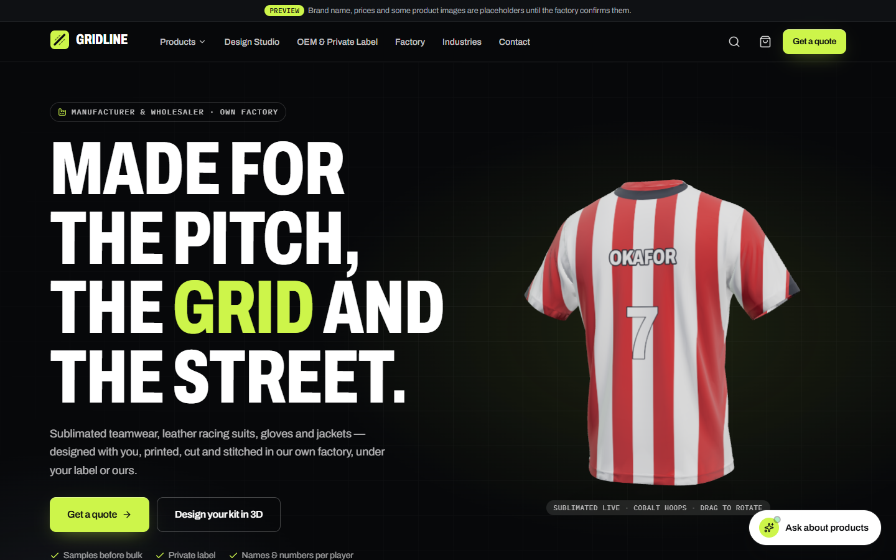
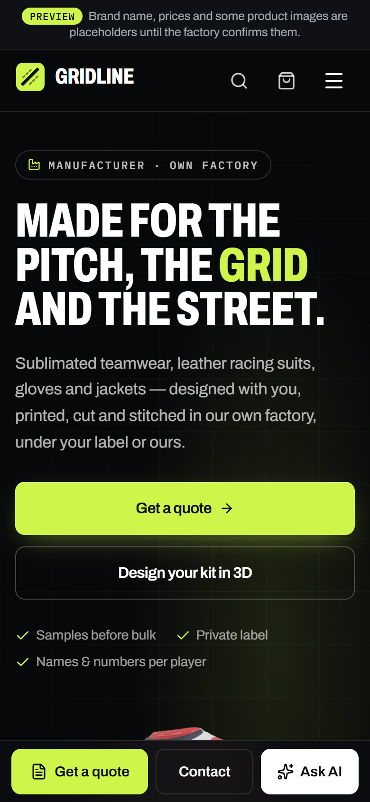
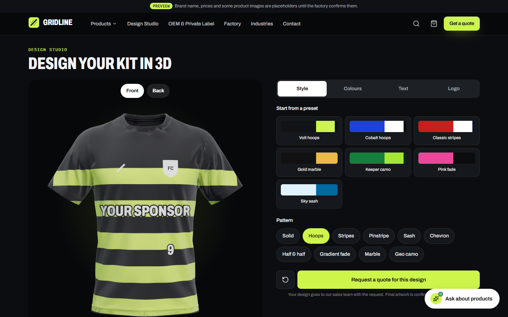
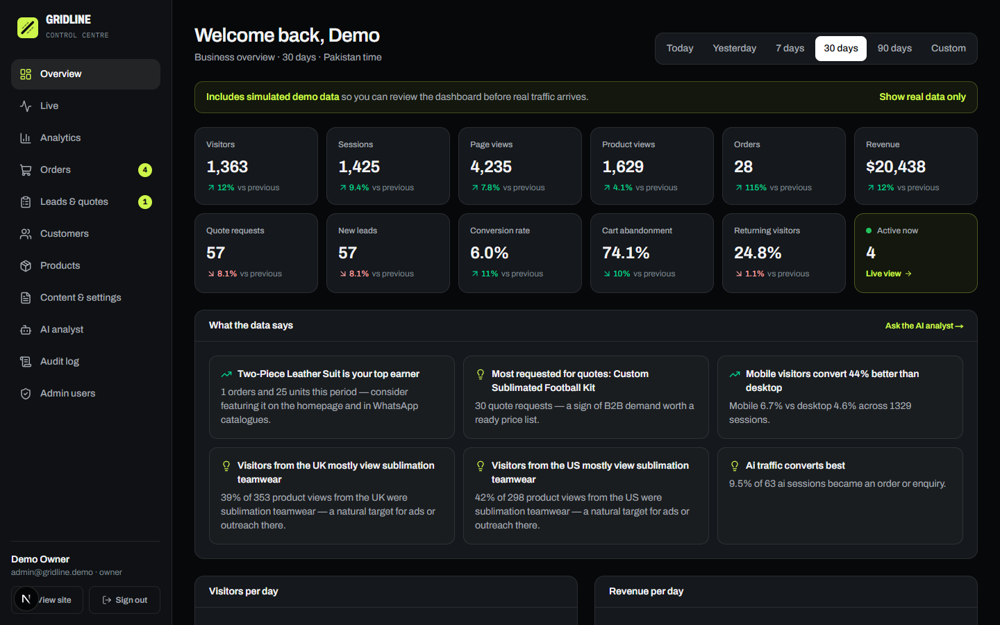
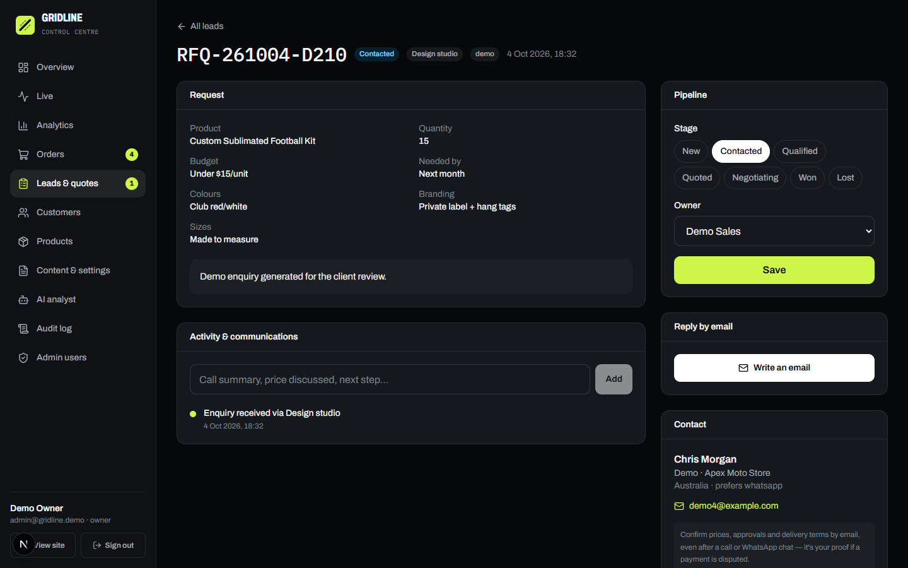

# Sports E-commerce & B2B Manufacturing Platform

A full-stack website for a sportswear and leather-goods **manufacturer and exporter** in Sialkot, Pakistan. It covers teamwear, racing suits, leather jackets and gloves. One site serves two kinds of buyer:

- **Bulk / OEM buyers** (clubs, brands, distributors) who need a fast, structured quote.
- **Small buyers** who want a sample or a small run with a cart and checkout.

It also includes a private admin for the factory team: orders, leads, analytics, content and an AI analyst.

> Working name: **Gridline**. The client's final brand name and domain are still to come.
> **Live demo:** https://gridline-sports-rho.vercel.app (preview build; search engines are blocked)



| Home (mobile) | Design Studio |
|---|---|
|  |  |

| Admin overview | Lead with email record |
|---|---|
|  |  |

---

## Highlights

**Storefront**
- Mobile-first, dark "Carbon & Volt" theme with a single accent colour and AA-contrast text.
- Restrained 3D: a real-time sublimated jersey (React Three Fiber). It gets a static poster on low-power devices and when reduced motion is on.
- Catalogue with category pages, filters, search and quantity price breaks.
- Product pages with specs, materials, customisation options, MOQ and lead time.
- Buying modes per product:
  - **Quote only** for bulk/OEM.
  - **Buy online** with a fixed price.
  - **Sample + quote**: buy a sample now, get a quote for the bulk order.
- **Design Studio**: customers design a kit (patterns, colours, name, number, sponsor, crest) on a live 3D model and send it with a quote request.
- Cart and checkout with prices re-calculated on the server. A recorded terms-of-sale acceptance and a signed, token-gated order tracking page.
- Factory section built from the factory's own footage: an edited tour, process clips and production photos.

**AI (free-tier providers, with a fallback that needs no AI at all)**
- **Product assistant.** It chats naturally (greetings, small talk, general questions) in English, Urdu, Roman Urdu and Hindi. Prices, MOQs, lead times and certifications come only from the catalogue data. Every product it recommends is checked against the live catalogue.
- **Quote assistant.** "Fill the form for me" turns a messy message into a structured quote request.
- **AI brief for sales.** Each enquiry is summarised for the sales team.
- **Admin AI analyst.** It answers questions about sales, products, countries and the funnel from computed metrics only. No customer names or contact details are sent to the model.
- Provider chain: Google Gemini → Groq → Vercel AI Gateway → deterministic grounded engine.

**Admin** (`/admin`, role-based: Owner, Admin, Sales, Editor)
- Overview KPIs with date ranges (today, yesterday, 7/30/90 days, custom), comparison with the previous period, and computed insights.
- Live visitors and an activity feed. Full analytics:
  - product performance flags (best seller, most wanted, leaking interest, underperforming)
  - conversion by device, channel and country
  - funnel
  - click analytics
- **Orders**: status, payment and shipping workflow, tracking numbers, internal notes. **QC and packing photos** are shared with the customer on their order page.
- **Leads pipeline**: New → Contacted → Qualified → Quoted → Negotiating → Won / Lost, with owners, notes, the AI brief, Design Studio artwork and the AI chat transcript.
- **Email record for disputes.** Every customer email (confirmations, status changes, quotes written in the admin) is logged against the order or lead with a timestamp and the provider's message ID. Together with the recorded terms acceptance and dated QC photos, this gives written evidence for refund or chargeback disputes with export customers.
- Customers with lifetime value; a product editor (photos, price breaks, specs, SEO); site settings, FAQs, buyer guides, testimonials and certifications.
- Testimonials and certificates can only be published after confirming they are real. A one-click purge removes the sample data.
- Audit log of every sign-in and change. Admin user management.

**Analytics without cookies**
First-party, consent-friendly tracking: an anonymous visitor id, and a daily-rotating id when Do Not Track or Global Privacy Control is on. Events are sent with `sendBeacon` to an allow-listed endpoint. Conversion events (orders, quotes, leads) are recorded on the server only, so they can't be faked from the browser.

## Tech stack

- **Framework:** Next.js 16 (App Router, Turbopack, Server Actions), React 19, TypeScript, Tailwind CSS 4
- **Database:** PostgreSQL (Supabase) via Prisma 7 with the `pg` driver adapter, a dedicated least-privilege role and a private schema
- **Auth:** JWT in an httpOnly, SameSite=strict cookie (`jose`); bcrypt; lockout stored in the database; token-version revocation; per-role permissions
- **AI:** Vercel AI SDK with structured output; Gemini / Groq / AI Gateway
- **3D:** three.js, React Three Fiber, drei; meshopt-compressed GLB with a custom projection shader
- **Email:** Resend, with a permanent `EmailLog`
- **Hosting:** Vercel

## Security

- Strict Content Security Policy and security headers.
- Same-origin checks on mutations, honeypots and rate limits on public forms.
- Every admin page and action re-validates the session against the database and checks role permissions.
- Uploads are sniffed by magic bytes, size-capped, de-duplicated and served with `nosniff`.
- Order pages need an HMAC-signed token.
- Secrets live only in environment variables; none are in this repository.

## Running locally

```bash
npm install
cp .env.example .env        # fill in DATABASE_URL, DIRECT_URL, AUTH_SECRET, admin credentials, optional AI keys
npx prisma db push
npm run db:seed             # catalogue + admin users (add --demo for simulated analytics)
npm run dev
```

```bash
npm test                    # unit tests (pricing, date ranges, assistant small talk)
```

## About this repository

This is the **public showcase** copy. It is synced automatically from the private working repository on every update.

The factory's own photos and videos (`public/media/factory`, `work`, `clips`, `films`) and internal planning documents are **not included**, out of respect for the client's privacy. Pages that use them will show empty media when run from this copy. Product images marked "placeholder" are generated stand-ins until the client supplies photography.

---

Designed and built by **Abdullah Rathore** · [GitHub](https://github.com/AbdullahRathoreVA)
